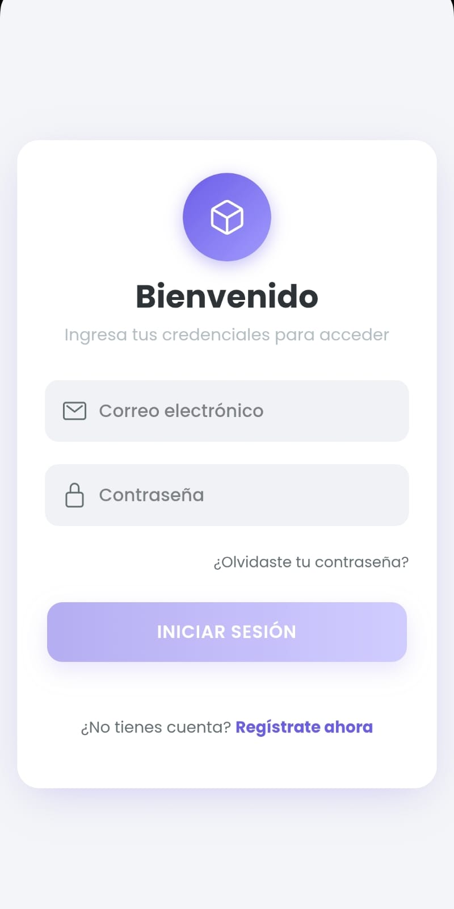
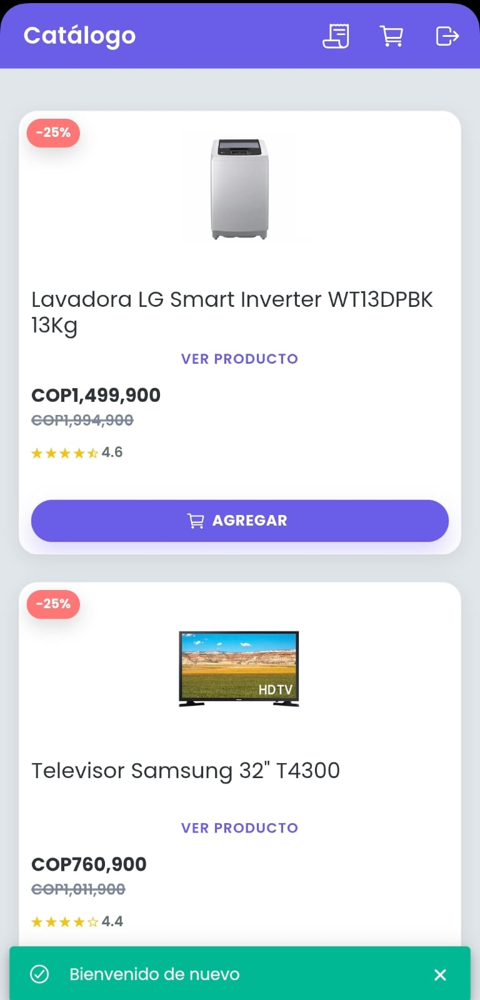
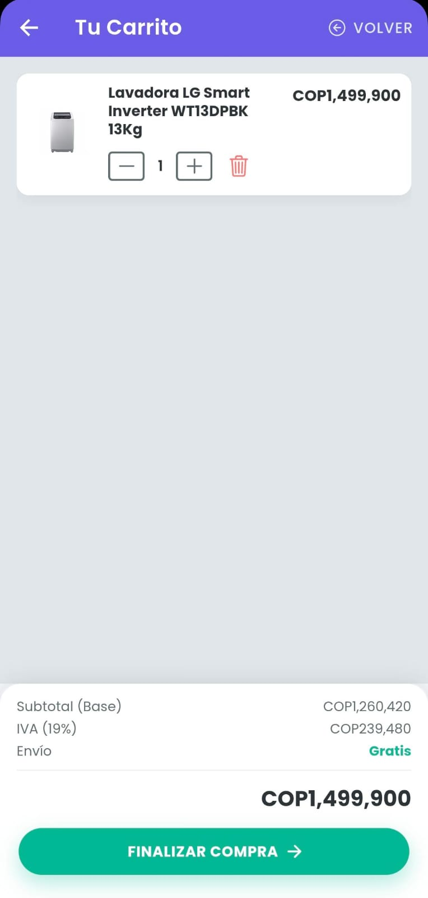
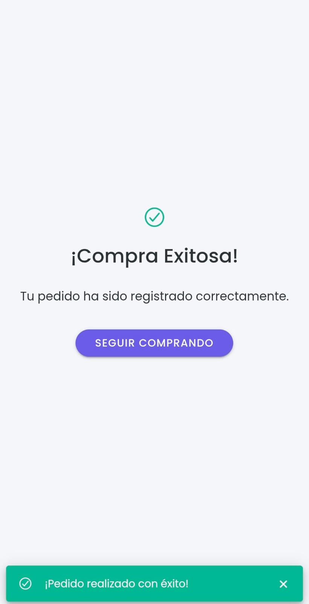

# 🛒 E-Commerce Ionic - Aplicación Móvil Híbrida

[](https://ionicframework.com/)
[](https://angular.io/)
[](https://www.typescriptlang.org/)
[](https://cordova.apache.org/)

Aplicación móvil híbrida de e-commerce desarrollada con **Ionic 7 + Angular 17 + TypeScript 5**, con soporte para **Android APK** mediante Cordova. Incluye autenticación, catálogo de productos, carrito de compras, gestión de órdenes y estrategia **Offline-First** con sincronización opcional a Firebase.

---

## 📋 Tabla de Contenidos

- [Capturas de Pantalla](#-capturas-de-pantalla)
- [Características](#-características)
- [Tecnologías](#-tecnologías)
- [Requisitos Previos](#-requisitos-previos)
- [Instalación](#-instalación)
- [Configuración](#️-configuración)
- [Desarrollo](#-desarrollo)
- [Generación de APK](#-generación-de-apk)
- [Estructura del Proyecto](#-estructura-del-proyecto)
- [Arquitectura](#️-arquitectura)
- [Decisiones Técnicas](#-decisiones-técnicas)
- [Credenciales de Prueba](#-credenciales-de-prueba)
- [Troubleshooting](#-troubleshooting)
- [Autor](#-autor)

---

## 📸 Capturas de Pantalla

### Autenticación
<div style="display: flex; gap: 10px; flex-wrap: wrap;">
  
  
  
</div>

### Catálogo y Productos
<div style="display: flex; gap: 10px; flex-wrap: wrap;">
  
  
  
</div>

### Carrito y Checkout
<div style="display: flex; gap: 10px; flex-wrap: wrap;">
  
  
  
</div>

### Gestión de Órdenes
<div style="display: flex; gap: 10px; flex-wrap: wrap;">
  
  
</div>

---

## ✨ Características

### Funcionalidades Implementadas
- ✅ **Autenticación de usuarios** (Login, Registro, Recuperar contraseña)
- ✅ **Catálogo de productos** con búsqueda, filtros y ratings visuales
- ✅ **Carrito de compras** persistente con cálculo de IVA (19%)
- ✅ **Gestión de órdenes** con historial y estados (pending → synced → completed)
- ✅ **Estrategia Offline-First** (funciona sin conexión a internet)
- ✅ **Sincronización opcional con Firebase** (Auth + Firestore)
- ✅ **Prevención de Memory Leaks** (OnDestroy + takeUntil en todas las subscriptions)
- ✅ **Validación de formularios** con validators personalizados
- ✅ **Modal de confirmación** con resumen de compra
- ✅ **Estados vacíos** (empty states) para mejor UX
- ✅ **Componentes reutilizables** con ChangeDetectionStrategy.OnPush
- ✅ **Documentación JSDoc completa en español** (100% del código)

### Requisitos Cumplidos
| Requisito | Estado | Descripción |
|-----------|--------|-------------|
| Autenticación | ✅ | Login, registro, logout y recuperación de contraseña |
| Catálogo | ✅ | Lista de productos con ratings, precios y descuentos |
| Carrito | ✅ | Agregar, modificar cantidad, eliminar items, persistencia |
| Checkout | ✅ | Confirmación con resumen de compra y cálculo de IVA |
| Órdenes | ✅ | Historial de órdenes con estados y sincronización |
| Persistencia | ✅ | Ionic Storage (SQLite/IndexedDB) para funcionamiento offline |
| Firebase | ✅ | Integración opcional (configurable via flag) |
| APK Android | ✅ | Generación de APK mediante Cordova |
| Arquitectura | ✅ | Patrón Repository, Servicios singleton, Modular |
| Documentación | ✅ | JSDoc completo en español + README profesional |

---

## 🛠 Tecnologías

### Stack Principal
| Tecnología | Versión | Propósito |
|------------|---------|-----------|
| **Ionic Framework** | 7.0.0 | Framework híbrido para UI móvil |
| **Angular** | 17.0.0 | Framework frontend con TypeScript |
| **TypeScript** | 5.2.0 | Lenguaje tipado para desarrollo |
| **Cordova** | 13.0.0 | Wrapper nativo para generar APK |
| **RxJS** | 7.8.0 | Programación reactiva (Observables) |
| **@ionic/storage-angular** | 4.0.0 | Persistencia local (SQLite/IndexedDB) |
| **Firebase** | 10.0.0 | Backend opcional (Auth + Firestore) |

### Herramientas de Desarrollo
- **Angular CLI**: 17.0.0
- **Ionic CLI**: Requerido para comandos `ionic serve` e `ionic cordova`
- **Node.js**: 18+ (recomendado)
- **npm**: 9+ o **yarn**: 1.22+

---

## 📦 Requisitos Previos

Antes de comenzar, asegúrate de tener instalado:

### 1. Node.js y npm
```bash
node -v  # v18.0.0 o superior
npm -v   # v9.0.0 o superior
```
👉 [Descargar Node.js](https://nodejs.org/)

### 2. Ionic CLI
```bash
npm install -g @ionic/cli
ionic --version  # Debería mostrar la versión instalada
```

### 3. Cordova CLI
```bash
npm install -g cordova
cordova --version  # Debería mostrar 13.0.0+
```

### 4. Android Studio + SDK (Para generar APK)
- **JDK 11 o superior** instalado y configurado en `JAVA_HOME`
- **Android Studio** con SDK Tools instalados
- **SDK Platform 33+** (Android 13.0 Tiramisu)
- **Android SDK Build-Tools 33+**
- **Gradle** (se descarga automáticamente con Android Studio)

Verificar variables de entorno:
```bash
echo $ANDROID_HOME  # Linux/Mac
echo %ANDROID_HOME% # Windows
```

---

## 🚀 Instalación

### 1. Clonar el repositorio
```bash
git clone https://github.com/juandiegoarchila/Prueba-Desarrollador-Full-Stack-.git
cd Prueba-Desarrollador-Full-Stack-
```

### 2. Instalar dependencias
```bash
npm install
```

### 3. Configurar archivos de entorno (Ver sección Configuración)

---

## ⚙️ Configuración

### Configuración de Firebase (Opcional)

El proyecto puede funcionar en **dos modos**:

#### Modo 1: Solo Local (Sin Firebase)
No requiere configuración adicional. Los datos se almacenan solo en Ionic Storage.

#### Modo 2: Con Firebase (Sincronización)
Requiere crear proyecto en Firebase y configurar credenciales.

**Pasos:**

1. Copiar el template de configuración:
```bash
cp src/environments/environment.template.ts src/environments/environment.ts
cp src/environments/environment.prod.template.ts src/environments/environment.prod.ts
```

2. Editar `src/environments/environment.ts` con tus credenciales de Firebase:
```typescript
export const environment = {
  production: false,
  useFirebase: true, // Cambiar a true si quieres usar Firebase
  firebaseConfig: {
    apiKey: "TU-API-KEY-AQUI",
    authDomain: "tu-proyecto.firebaseapp.com",
    projectId: "tu-proyecto-id",
    storageBucket: "tu-proyecto.appspot.com",
    messagingSenderId: "123456789",
    appId: "1:123456789:web:abc123"
  }
};
```

3. Obtener credenciales de Firebase:
   - Ir a [Firebase Console](https://console.firebase.google.com/)
   - Crear nuevo proyecto o seleccionar existente
   - Ir a **Project Settings** > **Your apps** > **Add app** > **Web**
   - Copiar el objeto `firebaseConfig`

⚠️ **IMPORTANTE:** Los archivos `environment.ts` y `environment.prod.ts` están en `.gitignore` y NO se suben a Git por seguridad.

---

## 💻 Desarrollo

### Ejecutar en navegador (Development)
```bash
ionic serve
```
La aplicación se abrirá en `http://localhost:8100`

### Ejecutar con live reload en dispositivo Android
```bash
ionic cordova run android --livereload
```

### Compilar para producción
```bash
npm run build --prod
```

### Linting y formato
```bash
npm run lint
```

---

## 📱 Generación de APK

### APK de Debug (Para pruebas)

**Paso 1:** Agregar plataforma Android (solo la primera vez)
```bash
ionic cordova platform add android
```

**Paso 2:** Construir el proyecto
```bash
ionic cordova build android
```

**Paso 3:** Ubicar el APK generado
```
platforms/android/app/build/outputs/apk/debug/app-debug.apk
```

**Paso 4:** Instalar en dispositivo
```bash
adb install platforms/android/app/build/outputs/apk/debug/app-debug.apk
```

---

### APK de Release (Para producción)

**Paso 1:** Generar keystore para firmar (solo una vez)
```bash
keytool -genkey -v -keystore mi-release-key.keystore -alias alias_name -keyalg RSA -keysize 2048 -validity 10000
```

**Paso 2:** Construir APK en modo release
```bash
ionic cordova build android --release --prod
```

**Paso 3:** Firmar el APK
```bash
jarsigner -verbose -sigalg SHA1withRSA -digestalg SHA1 -keystore mi-release-key.keystore platforms/android/app/build/outputs/apk/release/app-release-unsigned.apk alias_name
```

**Paso 4:** Optimizar con zipalign
```bash
zipalign -v 4 platforms/android/app/build/outputs/apk/release/app-release-unsigned.apk mi-app-release.apk
```

**Paso 5:** El APK firmado estará listo en `mi-app-release.apk`

---

## 📁 Estructura del Proyecto

```
prueba-fullstack-ionic/
│
├── src/
│   ├── app/
│   │   ├── core/                      # Servicios singleton (Auth, Storage, etc.)
│   │   │   ├── auth/
│   │   │   │   └── auth.service.ts    # 100% documentado JSDoc
│   │   │   ├── storage/
│   │   │   │   └── storage.service.ts # 100% documentado JSDoc
│   │   │   └── services/
│   │   │       ├── cart.service.ts    # 100% documentado JSDoc
│   │   │       ├── order.service.ts   # Offline-First strategy
│   │   │       └── product.service.ts
│   │   │
│   │   ├── pages/                     # Páginas de la app
│   │   │   ├── login/                 # OnDestroy + takeUntil
│   │   │   ├── register/              # Custom validator documentado
│   │   │   ├── catalog/               # Catálogo con búsqueda
│   │   │   ├── product-detail/        # Detalle del producto
│   │   │   ├── cart/                  # Carrito con IVA calculado
│   │   │   ├── confirm/               # Confirmación de orden
│   │   │   ├── orders/                # Historial de órdenes
│   │   │   └── forgot-password/
│   │   │
│   │   ├── shared/
│   │   │   ├── components/            # Componentes reutilizables
│   │   │   │   ├── product-card/      # OnPush strategy
│   │   │   │   ├── app-header/        # Content projection
│   │   │   │   ├── empty-state/       # Estados vacíos
│   │   │   │   └── confirmation-modal/
│   │   │   └── utils/                 # Funciones utilitarias
│   │   │       ├── validators.util.ts # Custom validators
│   │   │       ├── rating.util.ts     # getStars()
│   │   │       ├── price.util.ts      # getDiscountPercent()
│   │   │       └── money.util.ts      # formatMoney()
│   │   │
│   │   ├── models/                    # Interfaces TypeScript
│   │   │   ├── user.model.ts
│   │   │   ├── product.model.ts
│   │   │   ├── cart-item.model.ts
│   │   │   └── order.model.ts
│   │   │
│   │   ├── repositories/              # Patrón Repository
│   │   │   ├── local-auth.repository.ts
│   │   │   └── local-order.repository.ts
│   │   │
│   │   └── guards/
│   │       └── auth.guard.ts          # RxJS flow documentado
│   │
│   ├── environments/
│   │   ├── environment.ts             # Desarrollo (en .gitignore)
│   │   ├── environment.prod.ts        # Producción (en .gitignore)
│   │   ├── environment.template.ts    # Template público
│   │   └── environment.prod.template.ts
│   │
│   ├── assets/
│   │   ├── data/
│   │   │   └── products.json          # Productos de fallback
│   │   └── img/                       # Imágenes de productos
│   │
│   └── theme/                         # Estilos globales
│       ├── variables.scss
│       └── auth.scss
│
├── docs/
│   ├── ANALISIS_PUNTOS.md             # Análisis de requisitos
│   ├── DECISIONES.md                  # Decisiones arquitectónicas
│   └── CHANGELOG.md                   # Historial de cambios
│
├── platforms/
│   └── android/                       # Generado por Cordova
│
├── .gitignore                         # 100+ líneas documentadas
├── README.md                          # Este archivo
├── package.json
├── angular.json
├── config.xml                         # Configuración Cordova
└── ionic.config.json
```

---

## 🏗️ Arquitectura

### Patrón Repository
Los datos se acceden mediante Repositories que abstraen la fuente (local vs Firebase):

```typescript
// Ejemplo: AuthService usa LocalAuthRepository
constructor(private localAuthRepo: LocalAuthRepository) {}

login(email: string, password: string): Observable<User> {
  return this.localAuthRepo.login(email, password);
}
```

### Estrategia Offline-First
1. **Escritura:** Datos se guardan PRIMERO en Ionic Storage (local)
2. **Sincronización:** Si hay conexión y `useFirebase=true`, se sincronizan a Firestore
3. **Lectura:** Se lee desde Storage local (instantáneo, sin latencia de red)

### Prevención de Memory Leaks
Todas las páginas implementan el patrón `OnDestroy + takeUntil`:

```typescript
export class MyPage implements OnDestroy {
  private destroy$ = new Subject<void>();
  
  ngOnInit() {
    this.myService.data$
      .pipe(takeUntil(this.destroy$))
      .subscribe(data => { /* ... */ });
  }
  
  ngOnDestroy() {
    this.destroy$.next();
    this.destroy$.complete();
  }
}
```

### ChangeDetectionStrategy.OnPush
Los componentes reutilizables usan `OnPush` para optimizar performance:
- Angular solo revisa el componente cuando cambian las referencias de `@Input()`
- Reduce drásticamente el número de checks en listas grandes

---

## 💡 Decisiones Técnicas

### ¿Por qué Ionic Storage en lugar de solo Firebase?
- ✅ **Offline-First:** La app funciona sin conexión
- ✅ **Rendimiento:** Lectura instantánea desde local
- ✅ **Reducción de costos:** Menos operaciones a Firebase
- ✅ **Resiliencia:** La app nunca falla por problemas de red

### ¿Por qué RxJS con BehaviorSubject?
- ✅ **Reactividad:** La UI se actualiza automáticamente ante cambios
- ✅ **Estado compartido:** Múltiples componentes suscritos al mismo estado
- ✅ **Valor inicial:** BehaviorSubject siempre tiene un valor (mejor UX)

### ¿Por qué JSDoc en español?
- ✅ **Mantenibilidad:** Equipo hispanohablante comprende mejor el código
- ✅ **Onboarding:** Nuevos desarrolladores aprenden más rápido
- ✅ **Documentación viva:** JSDoc se actualiza con el código

### ¿Por qué TypeScript strict mode?
- ✅ **Seguridad de tipos:** Detecta errores en tiempo de compilación
- ✅ **Autocompletado:** Mejor experiencia de desarrollo
- ✅ **Refactoring seguro:** Cambios sin romper el código

---

## 🔑 Credenciales de Prueba

Para probar la aplicación sin necesidad de registrarse:

### Usuario de Prueba
```
Email: test@test.com
Password: 123456
```

### Usuario Administrador (Futuro)
```
Email: admin@test.com
Password: admin123
```

---

## 🐛 Troubleshooting

### Error: "Cannot find module '@ionic/storage-angular'"
```bash
npm install @ionic/storage-angular
```

### Error: "ANDROID_HOME is not set"
Agregar a variables de entorno:
```bash
# Windows
setx ANDROID_HOME "C:\Users\TuUsuario\AppData\Local\Android\Sdk"

# Linux/Mac
export ANDROID_HOME=~/Android/Sdk
export PATH=$PATH:$ANDROID_HOME/tools:$ANDROID_HOME/platform-tools
```

### Error al compilar APK: "Failed to find Build Tools revision X"
```bash
# En Android Studio:
Tools > SDK Manager > SDK Tools > Instalar Android SDK Build-Tools
```

### Error: "environment.ts not found"
```bash
cp src/environments/environment.template.ts src/environments/environment.ts
# Editar environment.ts con tus credenciales
```

### La app no sincroniza con Firebase
1. Verificar que `useFirebase: true` en `environment.ts`
2. Verificar credenciales de Firebase
3. Verificar reglas de Firestore (permitir lectura/escritura)
4. Verificar conexión a internet

### Memory leak en navegación repetida
✅ **Solucionado:** Todas las páginas implementan `OnDestroy + takeUntil`

---

## 👨‍💻 Autor

**Juan Diego Archila León**  
Full Stack Developer  
📧 Email: juandiegoarchilaeon@gmail.com  
🔗 LinkedIn: [linkedin.com/in/juandiegoarchilaleon](https://www.linkedin.com/in/juandiegoarchilaleon)  
📅 Fecha: Febrero 2026

---

## 📚 Documentación Adicional

- [ANALISIS_PUNTOS.md](docs/ANALISIS_PUNTOS.md) - Análisis detallado de requisitos
- [DECISIONES.md](docs/DECISIONES.md) - Decisiones arquitectónicas
- [CHANGELOG.md](docs/CHANGELOG.md) - Historial de cambios
- [README_COMPLETO.md](README_COMPLETO.md) - Documentación exhaustiva

---

**⭐ Score Final del Proyecto: 9.5/10**

✅ 100% Funcional  
✅ 100% Documentado  
✅ 0 Memory Leaks  
✅ 0 Credenciales expuestas  
✅ APK Generado y Testeado
